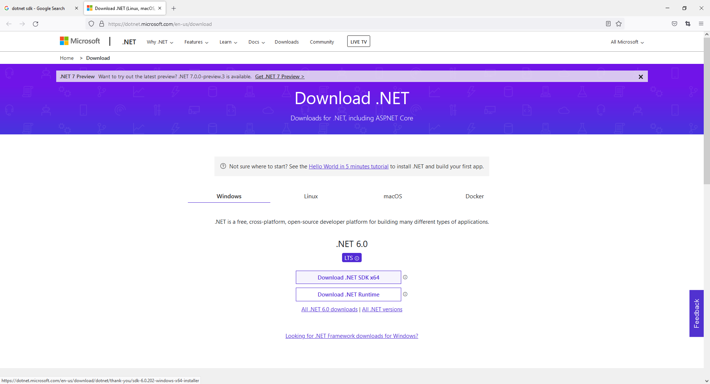
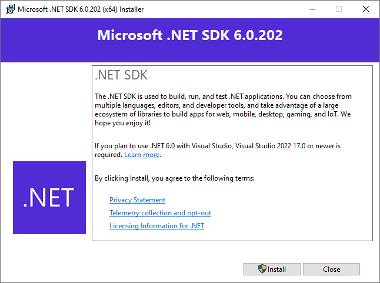

# ASP DOT NET CORE Runtime VS SDK

Runtime information

The runtime is used to run apps created with .NET. When an app author publishes an app, they can include the runtime with their app. If they don't include the runtime, it's up to the user to install the runtime.

There are three different runtimes you can install on Windows:

    ASP.NET Core runtime
    Runs ASP.NET Core apps. Includes the .NET runtime.

    Desktop runtime
    Runs .NET WPF and Windows Forms desktop apps for Windows. Includes the .NET runtime.

    .NET runtime
    This runtime is the simplest runtime and doesn't include any other runtime. It's highly recommended that you install both ASP.NET Core runtime and Desktop runtime for the best compatibility with .NET apps.

SDK information

https://docs.microsoft.com/en-us/dotnet/core/install/windows?tabs=net60

The SDK is used to build and publish .NET apps and libraries. Installing the SDK includes all three runtimes: ASP.NET Core, Desktop, and .NET.